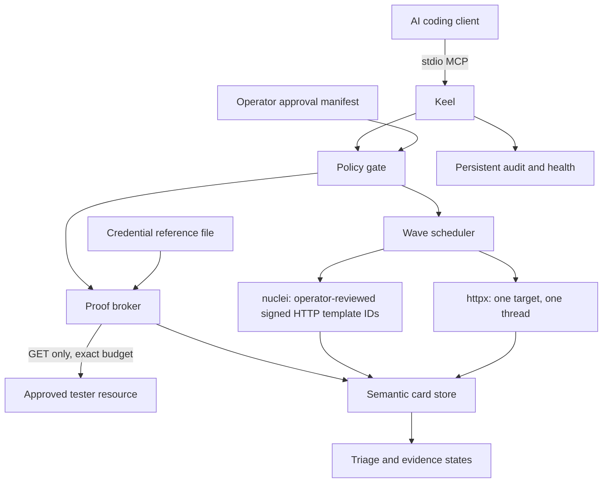

<div align="center">


#

### MCP control plane for authorized pentest and bug bounty

<!-- mcp-name: io.github.lutfizp/keel -->

[](https://www.python.org/)
[](https://github.com/lutfizp/keel/blob/main/LICENSE)
[](https://modelcontextprotocol.io/)
[](https://pypi.org/project/keel-pentest/)
[](https://github.com/lutfizp/keel)
[](https://github.com/lutfizp/keel)

**Ten MCP tools. Operator-bound scope. Bounded traffic. Evidence states, not scanner claims.**

[Architecture](#architecture) · [Installation](#installation) · [Operator setup](#operator-approval-and-credentials) · [Clients](#mcp-client-setup) · [Tools](#mcp-tools) · [Proofs](#bounded-proof-semantics) · [Security](#security-boundaries)

</div>

---

Keel is a local stdio MCP server for authorized web testing. It gives an AI a small control surface over ProjectDiscovery `httpx` and `nuclei`, normalizes their output into semantic finding cards, and admits only policy-bounded traffic.

Keel is designed around the difficult parts of agentic testing:

- exact scope and exclusions owned by the operator;
- conservative rate, concurrency, duration, response-size, and request budgets;
- deduplication across scanners by vulnerability class, normalized route, method, and parameter;
- explicit `observed`, `hypothesis`, `corroborated`, `proven`, and `refuted` states;
- proof playbooks that use disposable tester-owned data and never store response bodies or credentials;
- persistent waves, cooldowns, budgets, cards, and an append-only application audit log.

It is not an autonomous exploit generator and does not make every scanner alert exploitable. Today, only the strict canary-based cross-account read invariant can promote an access-control card to `proven`.

## Architecture

The model talks to Keel, not directly to scanner CLIs or a shell. Network approval and credential material live in operator-controlled files outside the AI-writable workspace.



### How it works

1. The operator creates a manifest that exactly binds an engagement id, scope, exclusions, traffic ceilings, reviewed Nuclei template IDs, expiry, credential references, and optional proof targets.
2. `begin_engagement` must fit inside that manifest. The legacy `operator_confirmed` argument is ignored and cannot grant permission.
3. `draft_waves` creates an exact reachability wave and, for host-wide scope without path exclusions, a safe template wave. Drafting sends no traffic.
4. `execute_wave` revalidates the manifest, selected template IDs, scope, cooldown, concurrency, and remaining budget before starting one external scanner process.
5. Scanner output is sanitized and merged into semantic cards. The agent may state impact, but that remains a hypothesis rather than manufactured proof.
6. `execute_proof` revalidates the manifest again and sends one or two brokered GET requests. A proof target must match the card URL, canary hash, playbook, and tester credential pair recorded by the operator.

## Installation

| Role | Name |
|---|---|
| PyPI distribution | `keel-pentest` |
| MCP stdio executable | `keel-pentest` |
| Python import / module | `keel` |
| Client server id | `keel` |
| MCP Registry name | `io.github.lutfizp/keel` |

Do not install the unrelated PyPI project named `keel`. Python 3.10 or newer is required.

For a persistent CLI application, use `pipx` or `uv tool`:

```bash
pipx install keel-pentest
# or
uv tool install keel-pentest

keel-pentest --version
```

Plain `pip` is supported inside a dedicated virtual environment:

```bash
python3 -m venv .venv
source .venv/bin/activate
python -m pip install --upgrade pip
python -m pip install keel-pentest
```

Keel also needs the ProjectDiscovery executables named `httpx` and `nuclei`. The Python package named `httpx` is a different program.

```bash
# macOS
brew install httpx nuclei
nuclei -update-templates

keel-pentest doctor
```

`doctor` checks Python, the MCP SDK, the writable state directory, scanner identity and required CLI flags, plus any configured approval or credential files. An old ProjectDiscovery build that lacks Keel's safety flags is rejected. Set `KEEL_HTTPX_BIN` and `KEEL_NUCLEI_BIN` to absolute paths when a GUI client has a reduced `PATH`.

Complete macOS, Linux, Windows, pipx, uv, pip, clone, upgrade, and uninstall instructions are in [INSTALL.md](https://github.com/lutfizp/keel/blob/main/INSTALL.md).

### Local clone

```bash
git clone https://github.com/lutfizp/keel.git
cd keel
sh scripts/bootstrap.sh
python3 scripts/keel_mcp.py doctor
```

Windows uses `scripts\bootstrap.ps1`. The MCP Registry entry is discovery metadata; installation from the Registry is not universal across clients.

## Operator approval and credentials

Network traffic is denied by default until `KEEL_APPROVAL_FILE` points to a valid operator-owned manifest. Keep both files outside any directory the AI client can edit.

```bash
install -m 600 examples/engagement-approval.json /safe/operator/path/keel-approval.json
install -m 600 examples/credentials.example.json /safe/operator/path/keel-credentials.json
```

Edit every placeholder, including `nuclei_template_ids`. Keel never runs the entire installed template collection: the engagement selects a subset of template IDs already reviewed and approved in the manifest. The credential file maps harmless names such as `tester-a` to an `Authorization` or `Cookie` value. MCP calls use only those names; raw secrets are never accepted as proof arguments.

For a proof, manually place a unique, non-secret canary in a disposable resource owned by tester A. Record the exact resource URL, allowed playbook, owner/peer credential refs, and SHA-256 of that canary in `proof_targets`:

```bash
python3 -c "import hashlib; print(hashlib.sha256(b'REPLACE_WITH_RANDOM_CANARY').hexdigest())"
```

Expose only the file paths to the Keel process:

```bash
export KEEL_APPROVAL_FILE=/safe/operator/path/keel-approval.json
export KEEL_CREDENTIALS_FILE=/safe/operator/path/keel-credentials.json
keel-pentest doctor
```

On POSIX systems, Keel rejects symlinked or group/world-writable approval files and rejects credential files accessible by group or other users. The manifest is hashed and revalidated before every wave and proof. If it changes, call `begin_engagement` again to resume under the new approval.

`KEEL_ALLOW_UNAPPROVED_RECON=1` exists only for local development and tests. Do not use it for a real target or bug-bounty program.

### Scope syntax

| Rule | Meaning |
|---|---|
| `target.example` | That exact host only; any HTTP(S) scheme, port, or path |
| `*.target.example` | Subdomains only; it does not include the apex host |
| `https://target.example:8443/api` | Exact scheme and effective port, with `/api` as a path prefix |

Exclusions always win. A host rule never matches `target.example.evil.test`, and engagement ids are restricted so they cannot escape the state directory.

Because external Nuclei requests are not yet mediated individually, Keel refuses `template_scan` and `second_look` when authorization is limited to a path or has a path-specific exclusion. Exact reachability and brokered proofs remain available. Use a host-wide rule only when the program actually authorizes the whole host.

## MCP client setup

Use the absolute executable path returned by `command -v keel-pentest` (Windows: `where.exe keel-pentest`):

```bash
claude mcp add --scope user --transport stdio keel -- /ABS/path/to/keel-pentest
codex mcp add keel -- /ABS/path/to/keel-pentest
gemini mcp add --scope user --transport stdio keel /ABS/path/to/keel-pentest
agy mcp add keel /ABS/path/to/keel-pentest
hermes mcp add keel --command /ABS/path/to/keel-pentest
```

Add `KEEL_APPROVAL_FILE`, `KEEL_CREDENTIALS_FILE`, and scanner path overrides to the server's environment rather than to prompts. OpenCode versions, VS Code, Cursor, Hermes, and other hosts use different configuration shapes; see [clients/README.md](https://github.com/lutfizp/keel/blob/main/clients/README.md) for exact examples and verification commands.

## Finding cards and evidence states

Keel does not deduplicate solely by scanner template id. It derives a semantic key from the canonical vulnerability class, normalized host/route, HTTP method, and parameter. Numeric ids, UUIDs, and long hex tokens in routes collapse to stable placeholders, allowing compatible observations from different tools to merge.

| State | Meaning |
|---|---|
| `observed` | One tool observed a condition; exploitability is not established |
| `hypothesis` | The scanner or agent proposed an impact |
| `corroborated` | Independent sources or a safe reachability check support the condition |
| `proven` | A strict allowlisted safe-proof invariant succeeded |
| `refuted` | The safe control test showed the alleged vulnerability was protected |

Agent-written impact text cannot by itself increase confidence to proof. A safe proof state cannot later be downgraded or overwritten by another scanner observation. Informational, hardening, and refuted cards are hidden by default but remain queryable.

## Traffic controls

- exact scope and exclusions are checked when drafting, admitting, ingesting, and proving; opaque template scans are denied when path-level enforcement cannot be guaranteed;
- one active wave per host, with a configurable maximum of one to four parallel hosts;
- shared global and per-host token buckets;
- persistent engagement request reservations and per-wave duration/request ceilings; every retry consumes a new reservation before scanner launch;
- no scanner retries, redirects, unapproved/unsigned Nuclei template IDs, OAST, headless, network, file, JavaScript, fuzzing, brute-force, intrusive, or DoS template classes;
- isolated empty scanner configs and stripped proxy/ProjectDiscovery-cloud environment variables prevent inherited settings from silently widening or exporting a wave;
- HTTP 429 stops the wave/proof and persists an exponential cooldown that honors `Retry-After`;
- bounded response reads and sanitized evidence without raw request/response bodies.

For brokered proofs, the request count is exact. For external `httpx` and `nuclei` processes, Keel reserves a conservative budget and derives the scanner rate from `budget / duration`, but it does not intercept every internal scanner request. See [Security boundaries](#security-boundaries).

## Bounded proof semantics

| Playbook | Requests | Result that counts |
|---|---:|---|
| `cross_account_read` | exactly 2 GETs | Tester A reads its pre-planted canary, then tester B receives 2xx and the identical canary from the exact same A-owned URL |
| `own_session_marker` | exactly 1 GET | Tester A reads a manually planted canary; this is only `corroborated`, never vulnerability proof |

For `cross_account_read`, a B response of 401, 403, or 404—or a 2xx without the canary—is classified `protected` and refutes the IDOR/BOLA card. A 5xx, redirect, missing A baseline, truncation that hides the marker, or other ambiguity is `inconclusive`, not protected and not proven.

Only access-control vulnerability classes can use `cross_account_read`. Keel stores status codes, canary presence booleans, truncation flags, and hashes of captured bytes; it does not persist bodies or secret header values.

## MCP tools

| Tool | Role |
|---|---|
| `begin_engagement` | Register exact scope and bounded traffic policy against operator approval |
| `draft_waves` | Propose exact reachability and, only for host-wide scope, a template scan; no traffic |
| `execute_wave` | Revalidate and run one admitted wave |
| `query_cards` | Return prioritized semantic cards |
| `second_look` | Re-run only the originating Nuclei template on one card URL |
| `state_impact` | Record an impact hypothesis and preconditions |
| `draft_proof` | Return an allowlisted proof plan; no traffic |
| `execute_proof` | Run a target-bound proof through the request broker |
| `engagement_health` | Show cooldowns, budgets, and pending waves |
| `engagement_audit` | Return recent append-only application audit events |

### Important `begin_engagement` arguments

| Argument | Default / bound |
|---|---|
| `engagement_id` | Stable id, 1–64 safe characters |
| `scope_hosts`, `exclude_hosts` | Must exactly equal the manifest |
| `requests_per_second` | `3.0`, maximum `20`, also bounded by manifest |
| `max_parallel_hosts` | `1`, maximum `4` |
| `max_wave_seconds` | `120`, range `10–600` |
| `max_wave_requests` | `120`, maximum `10,000` |
| `max_engagement_requests` | `1,000`, maximum `100,000` |
| `max_response_bytes` | `65,536`, range `1 KiB–1 MiB` |
| `max_proof_requests` | `2`, range `1–10` and playbook-bound |
| `nuclei_template_ids` | Reviewed subset of the manifest allowlist; empty means no template wave |
| `allow_safe_proof` | Session-level opt-in; manifest approval is still mandatory |
| `operator_confirmed` | Legacy compatibility argument; ignored |

`execute_proof` takes `proof_target_ref` and `expected_marker`. The optional legacy `session_a` and `session_b` values are credential-reference names only and, if supplied, must match the manifest binding. Never pass a raw token or cookie.

## Example workflow prompt

First, the human operator prepares the approval/credential files and, for a proof, the tester-A resource and canary. Then a useful recon/triage prompt is:

```text
Use only Keel MCP tools; do not shell out to httpx, nuclei, curl, or exploit tools.

1. begin_engagement for bb-2026-01 with exactly the scope, traffic limits, and
   reviewed nuclei_template_ids in my operator manifest. Set allow_safe_proof false.
2. draft_waves for https://target.example.
3. Execute one wave at a time. Stop immediately on throttling or policy denial.
4. query_cards with include_noise false.
5. Treat scanner output as observed/hypothesis only. Use state_impact only when
   preconditions and concrete hunter impact can be stated.
6. For plausible cards, call draft_proof only. Do not execute a proof.
7. Summarize semantic duplicates, evidence state, preconditions, and remaining
   uncertainty. Do not claim exploitable unless Keel reports proven.
```

After the operator has enabled `allow_safe_proof` by resuming the same engagement and has supplied an approved target reference:

```text
Execute only the drafted cross_account_read proof for card <card_id> using
proof_target_ref <operator-reference> and expected_marker <operator-canary>.
Omit session_a/session_b so Keel uses the manifest-bound tester credentials.
Stop after the result. Treat protected as refuted and any other failed invariant
as inconclusive.
```

The words “confirm” or `operator_confirmed: true` in a prompt do not authorize traffic. Only the external manifest does.

## Troubleshooting

**MCP server failed or import errors**

```bash
python3 --version
keel-pentest --version
keel-pentest doctor
```

Use Python 3.10+ and a pipx/uv-tool environment or dedicated virtual environment.

**`httpx` or `nuclei` not found**

Set `KEEL_HTTPX_BIN` and `KEEL_NUCLEI_BIN` to the absolute ProjectDiscovery executables. Keel deliberately rejects the Python HTTP client's unrelated `httpx` command.

**`begin_engagement` says approval is missing or mismatched**

Verify that `KEEL_APPROVAL_FILE` reaches the Keel subprocess, the engagement id/scope/exclusions exactly match, requested limits do not exceed the manifest, and `expires_at` is still valid. After editing the manifest, call `begin_engagement` again.

**`execute_proof` is denied**

Check `allow_safe_proof`, the manifest's playbook and proof target, the exact card URL, credential refs, canary SHA-256, file permissions, and expiry. A raw header in `session_a` is intentionally rejected because it is not an approved reference.

**Empty cards or retained wave**

Use `engagement_health` and `engagement_audit`. Nonzero scanner exits, 429 responses, and parse/scope failures do not consume the pending wave; request reservations remain fail-closed. Scanner JSONL is atomic: if any non-empty line is malformed, is not a JSON object, or lacks the scanner's minimum identity fields, Keel records `wave_parse_failed`/`wave_schema_failed` and ingests none of that wave's rows.

## Security boundaries

Keel reduces agent freedom; it does not turn active testing into a risk-free activity.

- Use it only with written authorization and within program rules.
- Keep approval, credentials, and preferably `KEEL_DATA_DIR` outside the AI-writable workspace.
- The local SQLite audit is append-only through Keel's API, not cryptographically tamper-evident against a local machine owner.
- External scanners enforce the arguments Keel supplies, but Keel 0.2.0 does not sit on the network path. Its external-scanner request ceiling is therefore conservative/approximate rather than a packet-level guarantee; path-bounded template scans are denied for this reason.
- A signature is not a safety classification. Keel requires explicit template IDs, but the operator must still review each selected template against program rules and keep limits low.
- Redirects and OAST are disabled, which deliberately trades some finding coverage for safety.
- `proven` currently has a narrow meaning: the approved cross-account canary invariant succeeded. Other vulnerability classes still require an operator-reviewed, class-specific safe playbook.
- Keel cannot guarantee complete coverage, valid authorization, target stability, or bounty acceptance.

See [SECURITY_MODEL.md](https://github.com/lutfizp/keel/blob/main/SECURITY_MODEL.md) for invariants and known limitations.

## Contributing

```bash
git clone https://github.com/lutfizp/keel.git
cd keel
sh scripts/bootstrap.sh python
source .venv/bin/activate
pytest
```

Useful contributions include semantic parsers, deterministic validators, and narrow allowlisted proof playbooks with explicit harm and cleanup invariants. Do not add free-form command execution or an unbounded scanner surface.

## License

Keel is released under the **MIT License**. See [LICENSE](https://github.com/lutfizp/keel/blob/main/LICENSE).

Copyright (c) 2026 [Lutfi Z.P.](https://github.com/lutfizp)

PyPI: **keel-pentest**. MCP Registry: **io.github.lutfizp/keel**. Source: [github.com/lutfizp/keel](https://github.com/lutfizp/keel).
