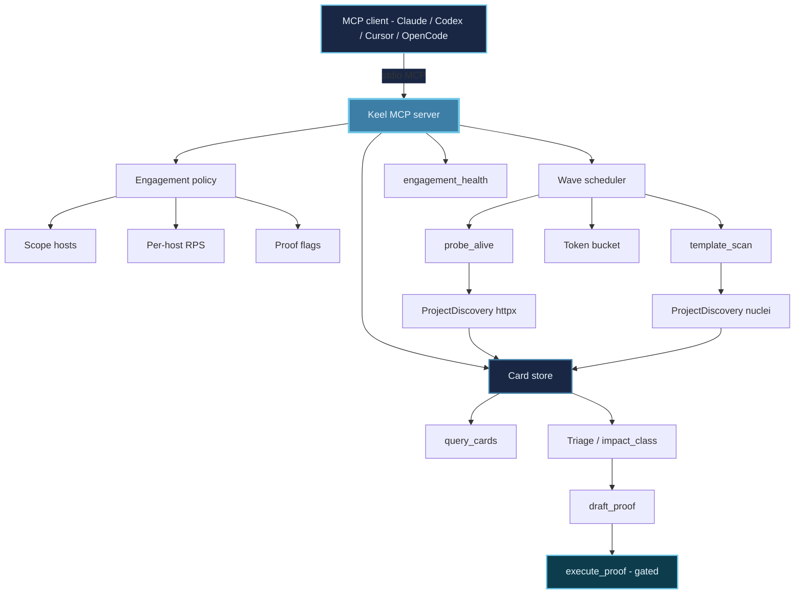

<div align="center">


# 

### MCP control plane for authorized pentest and bug bounty

<!-- mcp-name: io.github.lutfizp/keel -->

[](https://www.python.org/)
[](https://modelcontextprotocol.io/)
[](https://pypi.org/project/keel-pentest/)
[](https://github.com/lutfizp/keel)
[](https://github.com/lutfizp/keel)

**Nine MCP tools. One wave at a time. Per-host rate limits. Hunter-grade cards, not scanner dumps.**

[Architecture](#architecture-overview) · [Installation](#installation) · [MCP clients](#mcp-client-setup) · [Features](#features) · [Tools](#mcp-tools) · [Prompts](#example-prompts) · [Security](#security-considerations)

</div>

---

Keel is the MCP server you plug into Claude Code, Codex, Cursor, OpenCode, Hermes, Copilot, and any other MCP client. It runs **scoped recon**, keeps the target from getting hammered, and turns scanner output into **deduplicated cards**. Informational and missing-header noise stay hidden unless you ask. Bounded proofs use **your tester accounts** and a unique marker — never a free-form exploit generator.

Use it for:

- External and web pentest recon
- Bug bounty (scope in, noise out)
- Red-team style assessment with an AI copilot
- Repeatable engagements you can pause, query, and prove

---

## Architecture overview

The model talks only to Keel. Keel admits waves, rate-limits per host, parses `httpx` / `nuclei` output into a card store, then gates proofs behind operator flags.



### How it works

1. **Connect** — the client starts `python3 scripts/keel_mcp.py` (stdio). No separate HTTP sidecar.
2. **Begin** — `begin_engagement` records scope, RPS, and whether proofs are allowed.
3. **Draft then run** — `draft_waves` proposes `probe_alive` then `template_scan`. `execute_wave` runs **one** admitted wave behind the per-host bucket.
4. **Triage** — `query_cards` returns hunter-relevant cards. `state_impact` records `impact_class`. `second_look` rescans one URL.
5. **Prove** — `draft_proof` describes an allowlisted playbook. `execute_proof` runs only if `allow_safe_proof` and `operator_confirmed` are set.

---

## Installation

### One command

```bash
git clone https://github.com/lutfizp/keel.git
cd keel
sh scripts/bootstrap.sh
```

Windows:

```powershell
powershell -ExecutionPolicy Bypass -File scripts\bootstrap.ps1
```

The script creates `.venv` with Python **3.10+**, installs Keel, then installs ProjectDiscovery `httpx` and `nuclei`.

Do **not** create the venv with Apple `/usr/bin/python3` when it is 3.9. The `mcp` package has no 3.9 wheels (`No matching distribution found for mcp>=1.9`).

Partial runs:

```bash
sh scripts/bootstrap.sh python   # venv + Keel only
sh scripts/bootstrap.sh tools    # nuclei + httpx only
```

OS-specific steps: [INSTALL.md](INSTALL.md).

### Probe binaries

| Binary | Role |
|--------|------|
| ProjectDiscovery `httpx` | Alive / HTTP probe (`probe_alive`) |
| ProjectDiscovery `nuclei` | Template scan (`template_scan`) |

The Python library `httpx` is a Keel dependency. It is **not** the CLI.

### Verify

```bash
source .venv/bin/activate
python -c "import mcp, keel; print('keel ok')"
httpx -version
nuclei -version
```

OpenCode, Cursor, and the other in-repo configs use:

```text
python3 scripts/keel_mcp.py
```

The launcher selects a 3.10+ `.venv`. Optional: `KEEL_PYTHON`, `KEEL_ROOT`. Set `PYTHONUNBUFFERED=1` so JSON-RPC is not buffered.

PyPI: `pip install keel-pentest` then `keel-pentest` or `python -m keel`. Registry name: `io.github.lutfizp/keel`.

---

## MCP client setup

This repo already includes project configs when **keel** is the workspace root:

| Host | File |
|------|------|
| OpenCode | `opencode.json` |
| Claude Code | `.mcp.json` |
| Cursor | `.cursor/mcp.json` |
| VS Code / Copilot | `.vscode/mcp.json` |
| Codex | `.codex/config.toml` |

Snippets for Claude Desktop, Hermes, Gemini CLI, Antigravity (`agy`), Windsurf, Cline, Roo: [clients/README.md](clients/README.md).

### OpenCode

```json
{
  "mcp": {
    "servers": {
      "keel": {
        "type": "local",
        "command": ["python3", "scripts/keel_mcp.py"]
      }
    }
  }
}
```

OpenCode v2 uses `mcp.servers` instead of a flat `mcp` map. Keep the same `command` array.

### Claude Code

```bash
cd /path/to/keel
claude mcp add --scope project --transport stdio keel -- python3 scripts/keel_mcp.py
```

### Claude Desktop / Cursor-style `mcpServers`

```json
{
  "mcpServers": {
    "keel": {
      "command": "python3",
      "args": ["/ABS/path/to/keel/scripts/keel_mcp.py"]
    }
  }
}
```

### Codex

```bash
codex mcp add keel -- python3 /ABS/path/to/keel/scripts/keel_mcp.py
```

Restart the client after bootstrap.

---

## Features

### Control plane (not a 150-tool dump)

The model never shells `nuclei` or `httpx` itself. It only calls Keel tools. Waves are admitted one at a time. Each host has a token bucket from `requests_per_second`.

### Finding cards

Parsers turn `httpx` JSON and nuclei JSONL into a SQLite card store. Fingerprints merge duplicates. Informational and hardening findings are hidden by default (`query_cards` with `include_noise` false).

### Hunter triage

`impact_class` values: `none`, `hardening`, `sensitive_access`, `account_takeover`, `rce`, `data_other_users`. CVSS-style scanner scores are not the hunter gate.

### Bounded proofs

Allowlisted playbooks only:

| Playbook | Intent |
|----------|--------|
| `cross_account_read` | Show another tester account can read a resource |
| `own_session_marker` | Show the operator’s own session can plant/read a marker |

`execute_proof` requires `allow_safe_proof` and `operator_confirmed`. Tester sessions only. No DoS, no other users’ data, no exploit generation.

### Layout

Policy, scheduler, adapters, parsers, store, triage, and proof live in separate packages under `src/keel/`. Engagement data: `.data/engagements` in the repo (not `~/.keel` for the database).

---

## MCP tools

| Tool | Role |
|------|------|
| `begin_engagement` | Scope, RPS, proof flags, tester account ids |
| `draft_waves` | Propose `probe_alive` then `template_scan` |
| `execute_wave` | Run one admitted wave |
| `query_cards` | Cards without informational/hardening by default |
| `second_look` | Bounded rescan of one card URL |
| `state_impact` | Hunter `impact_class` |
| `draft_proof` | Allowlisted proof plan (no traffic) |
| `execute_proof` | Proof only if flags are set |
| `engagement_health` | Cooldowns, paused hosts, pending waves |

### `begin_engagement` arguments

| Argument | Notes |
|----------|--------|
| `engagement_id` | Stable id (`bb-2026-01`) |
| `scope_hosts` | In-scope hostnames |
| `exclude_hosts` | Optional |
| `requests_per_second` | Default `3.0` |
| `allow_safe_proof` | Default `false` |
| `operator_confirmed` | Default `false` |
| `tester_account_a` / `tester_account_b` | Optional labels |

---

## Example prompts

Replace `target.example` with an in-scope host. Always start with `begin_engagement` unless the engagement already exists. The client must call **Keel MCP**, not shell `nuclei` / `httpx`.

State that you are authorized (owner, employer, or in-scope bounty). Vague “hack this site” prompts get refused by most models.

### End-to-end bug bounty

```
You are a bug bounty hunter. Use only the Keel MCP tools. Do not run nmap, nuclei, or httpx yourself.

1. begin_engagement:
   - engagement_id: bb-2026-01
   - scope_hosts: ["target.example"]
   - exclude_hosts: []
   - requests_per_second: 3
   - allow_safe_proof: false
   - operator_confirmed: false

2. draft_waves with seed_url https://target.example
3. execute_wave once per wave_id, wait for each to finish
4. query_cards (include_noise false)
5. For each remaining card, state_impact with a hunter impact_class
   (none / hardening / sensitive_access / account_takeover / rce / data_other_users)
   and why a hunter would care. Drop informational and missing-header noise.
6. For cards that still look like real impact, draft_proof only
   (playbook_id: cross_account_read or own_session_marker).
   Do not call execute_proof until I say the word CONFIRM.

Stop after draft_proof. Summarize cards, impact, and the proof plan in English.
```

When you are ready to run a bounded proof (tester accounts only):

```
CONFIRM. Call begin_engagement again on bb-2026-01 with allow_safe_proof true
and operator_confirmed true, then execute_proof on card <card_id>
playbook_id cross_account_read. session_a and session_b are my tester
Authorization headers. One request pair. No DoS, no other users' data.
```

### Recon only

```
Keel MCP only. begin_engagement id recon-1, scope_hosts ["target.example"],
RPS 2, allow_safe_proof false. draft_waves for https://target.example.
execute_wave only the probe_alive wave. Do not run template_scan.
Then engagement_health. Tell me which hosts answered. Stop.
```

### Templates only (after recon)

```
Engagement recon-1 is already open. draft_waves is done. execute_wave only
the template_scan wave_id. Then query_cards. Do not draft_proof. Stop.
```

### Cards / triage only

```
query_cards for engagement_id bb-2026-01. If empty, query_cards with
include_noise true and list what you would drop as hardening. No new waves.
```

### Impact only

```
state_impact on card <card_id>, engagement bb-2026-01.
impact_class data_other_users if IDOR-like, else none.
preconditions: two tester accounts. hunter_why: one sentence.
Do not scan and do not prove.
```

### Proof plan only (no traffic)

```
draft_proof engagement bb-2026-01 card <card_id> playbook_id own_session_marker.
Do not execute_proof.
```

### Status

```
engagement_health for bb-2026-01. If unknown, engagement_health with no id.
```

---

## Troubleshooting

**MCP server failed / import errors**

Use Python 3.10+ and the launcher, not Apple 3.9:

```bash
python3 --version
python3 scripts/keel_mcp.py
```

If `mcp>=1.9` cannot install, recreate `.venv` with 3.12/3.11/3.10 (`sh scripts/bootstrap.sh python`).

**httpx / nuclei not found**

```bash
which httpx nuclei
sh scripts/bootstrap.sh tools
nuclei -update-templates
```

**Empty cards after a wave**

Check `engagement_health` for paused hosts (rate limit / 429). Lower RPS. Confirm the host is in `scope_hosts` and the seed URL is reachable.

**execute_proof denied**

Call `begin_engagement` again with `allow_safe_proof` true and `operator_confirmed` true. Use only allowlisted `playbook_id` values.

---

## Security considerations

Keel gives an AI client the ability to probe in-scope hosts through `httpx` and `nuclei`, and to run two narrow proof playbooks. Run it only on systems you are allowed to test. Watch `engagement_health` and keep RPS conservative on bounty programs.

### Legal and ethical use

- Authorized penetration testing with written permission
- Bug bounty programs, inside program scope and rules
- Security research on systems you own or are authorized to test
- Red-team exercises with organizational approval

- Never test systems without permission
- No illegal access, data theft, or damage
- Proofs: tester accounts only; no other users’ data

---

## Contributing

```bash
git clone https://github.com/lutfizp/keel.git
cd keel
sh scripts/bootstrap.sh python
source .venv/bin/activate
pytest
```

Useful areas: parsers, triage, additional **allowlisted** proof playbooks, client snippets. Do not add unbounded exploit generators or a dump of unrelated scanner CLIs onto the MCP surface.

---

## License and author

Package: **keel-pentest** on PyPI. MCP: **io.github.lutfizp/keel**.

[Lutfi Z.P.](https://github.com/lutfizp) — [github.com/lutfizp/keel](https://github.com/lutfizp/keel)

If you add a `LICENSE` file to this repo, link it here.
