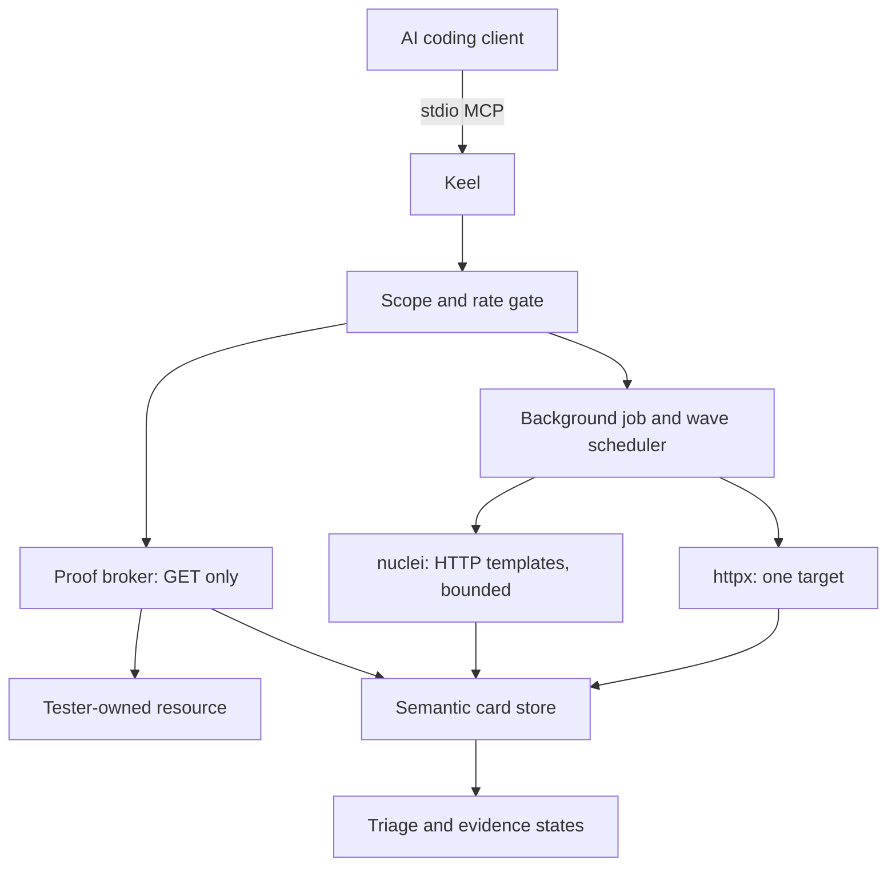

<div align="center">


# Keel

### The MCP control plane that turns scanner noise into hunter-grade, non-destructive proofs

<!-- mcp-name: io.github.lutfizp/keel -->

[](https://www.python.org/)
[](https://github.com/lutfizp/keel/blob/main/LICENSE)
[](https://modelcontextprotocol.io/)
[](https://pypi.org/project/keel-pentest/)
[](https://github.com/lutfizp/keel)
[](https://github.com/lutfizp/keel)

**Thirteen MCP tools. Semantic dedup. Per-host rate limits. Safe proofs that show what a hunter can do — without damaging the target.**

[Why Keel](#why-keel) · [Install](#installation) · [Clients](#mcp-client-setup) · [Proofs](#safe-proofs-that-still-prove-impact) · [Tools](#mcp-tools)

</div>

---

Dumping 150 tools on an agent is easy. The hard problems are **dedup across tools**, **exploitable vs noise**, and **not hammering the target**. Keel is the control plane for those three.

An AI client talks to Keel, not to `httpx`, `nuclei`, or a shell. Keel drafts one wave at a time, enforces scope and rate limits, merges scanner hits into semantic cards, and runs **GET-only playbooks on tester-owned data**. When a playbook returns `proven`, you get a curl replay a hunter can follow — still without writes, shells, or payload spam.

Use it on programs you are authorized to test.

## Why Keel

| Hard problem | What scanner dumps do | What Keel does |
|---|---|---|
| Dedup across tools | One Nuclei template id per row; the same IDOR appears five times | Semantic key from vulnerability class + normalized route + method + parameter. UUID/id/hex tokens collapse. Compatible observations merge. |
| Exploitable vs noise | High severity = "ship it" | Cards move through `observed` → `hypothesis` → `corroborated` → `proven` / `refuted`. Informational and hardening stay hidden. Typed exploitability names the missing evidence and the negative control. |
| Not hammering the target | Fire every template at once, retry on 429 | One active wave per host, token buckets, Nuclei concurrency 1, no OAST, no redirects, no unsigned templates, no dos/fuzz/bruteforce/intrusive tags. HTTP 429 becomes a cooldown. |

A wrapper that shells out to a huge toolbox does not have that layer. Keel does — in the scheduler, in the adapters, and in the proof broker.

## Architecture



1. `begin_engagement` with the hostname you are authorized to test.
2. `draft_waves` proposes reachability plus template micro-waves. No traffic yet.
3. `execute_wave` returns a job immediately. Poll `wave_status`. `cancel_wave` kills the scanner.
4. `query_cards` returns hunter-relevant cards. `assess_exploitability` says what would prove it.
5. `draft_proof` then `execute_proof` run a GET-only playbook against tester data. `proven` means the invariant held. `protected` means the control worked.

## Installation

macOS (Homebrew). `pipx` is a separate tool — install it first. Apple's `/usr/bin/python3` is often 3.9 and cannot install Keel.

```bash
brew install pipx python@3.12
pipx ensurepath
# open a new terminal, then:
pipx install keel-pentest
keel-pentest setup
keel-pentest doctor
```

If `python3.12` is already on the machine and you do not want Homebrew pipx:

```bash
python3.12 -m pip install --user pipx
python3.12 -m pipx ensurepath
python3.12 -m pipx install keel-pentest
```

`setup` downloads ProjectDiscovery `httpx` and `nuclei` into `~/.keel/bin`. Keel finds them there even when a GUI client has a thin `PATH`. No extra `KEEL_HTTPX_BIN` for a first scan.

Then point your MCP client at the `keel-pentest` executable:

```bash
claude mcp add --scope user --transport stdio keel -- keel-pentest
codex mcp add keel -- keel-pentest
hermes mcp add keel --command keel-pentest
```

OpenCode: `"command": ["keel-pentest"]`.

Python 3.10+. Do not `pip install keel` — that is a different project. OS notes and pip/venv: [INSTALL.md](INSTALL.md). Client shapes: [clients/README.md](clients/README.md).

Optional later: `KEEL_APPROVAL_FILE` for a team manifest that pins scope, template IDs, and proof targets. Default mode is self-attested — `begin_engagement` is the authorization. Rate limits, one-wave-per-host, signed templates, and sanitized evidence still apply.

## Safe proofs that still prove impact

Scanner output is a hypothesis. Keel proves (or refutes) it with disposable tester accounts and a unique canary. Every playbook is GET-only, budgeted, and returns a curl replay. The replay is the report artifact: *if this is not fixed, a hunter with a normal account can do this*.

| Playbook | Proves | How, without damage |
|---|---|---|
| `cross_account_read` | IDOR / BOLA | Tester A reads its canary; tester B GETs the same A-owned URL. Identical canary + 2xx = `proven`. 401/403/404 or 2xx without the canary = `protected` (refuted). |
| `reflected_marker` | Reflected XSS / HTML injection | Inject a unique marker plus a harmless `<keel>` probe. Unescaped reflection = `proven`. HTML-encoded reflection = `protected`. Control GET must not already contain the probe. |
| `open_redirect_canary` | Open redirect | Point the redirect parameter at `https://keel-proof.invalid/<marker>`. A 3xx whose Location host is that canary = `proven`. |
| `unauth_access_probe` | Missing authZ | Tester A baseline must show the canary; the same URL with no credentials must not. 2xx + canary unauthenticated = `proven`. |
| `own_session_marker` | Reachability only | A reads its own canary. This is `corroborated`, never vulnerability proof. |

`execute_proof` stores status codes, canary booleans, truncation flags, hashes, hunter impact text, and the repro script. It does not persist response bodies or secrets.

Plant a non-secret canary in a tester-owned object before `cross_account_read` / `unauth_access_probe`. Reflected XSS and open redirect inject the marker themselves.

## MCP tools

| Tool | Role |
|---|---|
| `begin_engagement` | Register scope and traffic ceilings |
| `draft_waves` | Propose reachability + template micro-waves; no traffic |
| `execute_wave` | Queue one background job |
| `wave_status` | Stage, progress, result; omit `job_id` to list |
| `cancel_wave` | Stop a queued or running scanner |
| `query_cards` | Prioritized semantic cards |
| `second_look` | Re-run only the originating Nuclei template |
| `assess_exploitability` | Candidate impact, missing evidence, negative control, playbooks |
| `state_impact` | Record a hunter hypothesis |
| `draft_proof` | Allowlisted proof plan; no traffic |
| `execute_proof` | Run the GET-only playbook |
| `engagement_health` | Cooldowns, budgets, pending waves |
| `engagement_audit` | Append-only application events |

`begin_engagement` needs `engagement_id` and `scope_hosts` (plain hostnames, e.g. `target.example`). Defaults: 3 req/s, one host at a time, 120s / 120 requests per wave. `allow_safe_proof=true` enables proofs. Pass tester credential *names* only; put secrets in `KEEL_CREDENTIALS_FILE`.

## Example prompt

```text
Use only Keel MCP tools. Do not shell out to httpx, nuclei, curl, or exploit tools.

1. begin_engagement for bb-2026-01 with scope_hosts ["target.example"], 3 req/s.
   Set allow_safe_proof true if I will run proofs.
2. draft_waves for https://target.example.
3. execute_wave for each wave. Poll wave_status until completed, retryable_failed,
   terminal_failed, or cancelled.
4. query_cards (include_noise false), then assess_exploitability on candidates.
5. For a card with a safe playbook, draft_proof then execute_proof using tester
   credential names and the canary I planted. Treat protected as refuted.
6. Summarize duplicates, evidence state, hunter_impact, and the repro_script.
   Claim exploitable only when Keel reports proven.
```

## Traffic controls

- Exact scope and exclusions on draft, admit, ingest, and proof
- One wave per host; same-host jobs wait
- Shared global and per-host token buckets
- Persistent request reservations; retries consume a new reservation
- Nuclei: signed HTTP templates, no OAST, no redirects, no retries, exclude dos/fuzz/bruteforce/intrusive
- Isolated empty scanner configs; proxy and ProjectDiscovery-cloud env vars stripped
- HTTP 429 stops the wave and honors Retry-After
- Bounded response reads; evidence without raw bodies

## Troubleshooting

```bash
keel-pentest doctor
keel-pentest setup    # if doctor reports missing httpx/nuclei
```

`begin_engagement` after a client restart restores the SQLite engagement. If you changed scope, use a new `engagement_id`.

Proofs need `allow_safe_proof=true` and, for session playbooks, `KEEL_CREDENTIALS_FILE` mapping names like `tester-a` to Authorization or Cookie.

## License

MIT. Copyright (c) 2026 [Lutfi Z.P.](https://github.com/lutfizp)

PyPI: **keel-pentest**. MCP Registry: **io.github.lutfizp/keel**. Source: [github.com/lutfizp/keel](https://github.com/lutfizp/keel).
